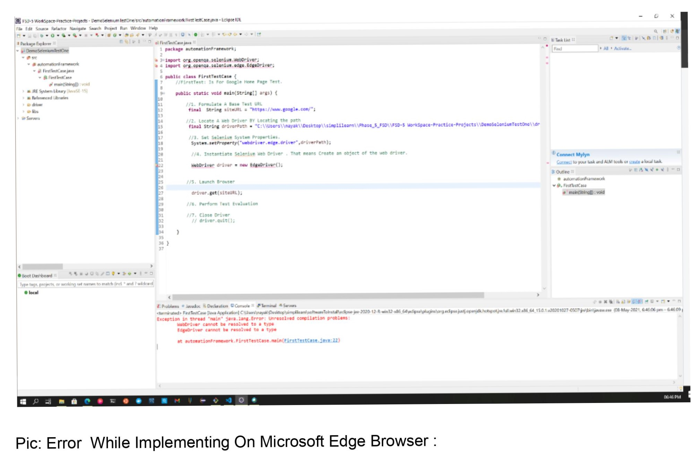
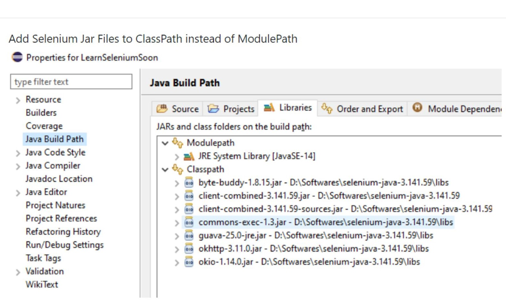

# Steps To Set Up A WebDriver: 

1. > Download Selenium Standalone Server.jar from the official site:  [Click Here To Download .jar File For Java](https://www.selenium.dev/downloads/)

2. > Download Selenium WebDriver `Specific to your Browser.
3. > My microsoft edge version is: ` 90.0.818.56` So, I downloads, 
[Edge Browser Version: 90.0.818.56: x64](https://developer.microsoft.com/en-us/microsoft-edge/tools/webdriver/#downloads)

4. > Lunch Eclipse and create a java project or maven based java project
   
5. > Configure `WebDriver` with Eclipse.

>Now , you all set to write your first test script using `Selenium Web Driver With Eclipse`.  


# Configure Selenium WebDriver With Eclipse:

> **Step-1**: Launch Eclipse And Create A WorkSpace 

> My Current Workspace Name: ` FSD-5 Workspace-Practice-Projects `

>**Step-2:** Create New Java Project In Eclipse:

 ```
File-> New -> Other -> java project 

Project Name: SeleniumEdgeDriverTestOne
 ```
 **Note:**  Click `No to open perspective pup up window`. 

> **Step-3**: Copy all the libreries files , what you have downloaded to the current project.Then right click on the project name and  `refresh` the project .

>**Step-4:** ` How to add Selenium WebDriver Jars to the project?`

 After it, Right click on the `project name` -> Click on `Build Path` -> `Configure Build Path` -> Click on `Libraries` -> `Click on ClassPath`-> `Add Jars` -> Then Add all the `.jar files inside lib folder` -> `click ok` -> `Click on Apply and Close` .


>**Step-5:** Now Let's write `test cases`. So create ` A Class`. 
```
Package Name: automationFramework 
Class Name : GoogleHomePageTest.java
And Check the Main Method.
```

>**Step-5:** Write The code for the `Class:GoogleHomePageTest.java` .

```
//FirstTest: Is For Google Home Page Test.

//1. Formulate A Base Test URL

 final  String siteURL = "https://www.google.com/";
         
//2. Locate A Web Driver BY Locating the path

  final String driverPath = "driver\\msedgedriver.exe";

//3. Set Selenium System Properties.

System.setProperty("webdriver.edge.driver",driverPath);

//4. Instsntiate Selenium Web Driver . That means Create an object of the web driver.
 
 WebDriver driver = new EdgeDriver();
          
//5. Launch Browser

   driver.get(siteURL);

//6. Perform Test Evaluation 
         String expectedTitle = "Google";
         
         if (expectedTitle.equals(driver.getTitle())) {
        	 System.out.println("Test is Passed !");
         }else {
        	 System.out.println("Test is Failed !");
         }
         

//7. Close Driver 

 driver.close ();


```
# Error-1 :
 Error Snapshot :
 
 
```
Error Message: 
Exception in thread "main" java.lang.Error: Unresolved compilation problems: WebDriver cannot be resolved to a type EdgeDriver cannot be resolved to a type at automationFramework.FirstTestCase.main(FirstTestCase.java:22)
```

# Resolved Error-1:

> Go to buildpath -> configure Build Path -> Java Build path -> Click on `Class Path` -> then Click on Add Jars -> Add .jar files from the `lib` folders. 

> And error resolved.

